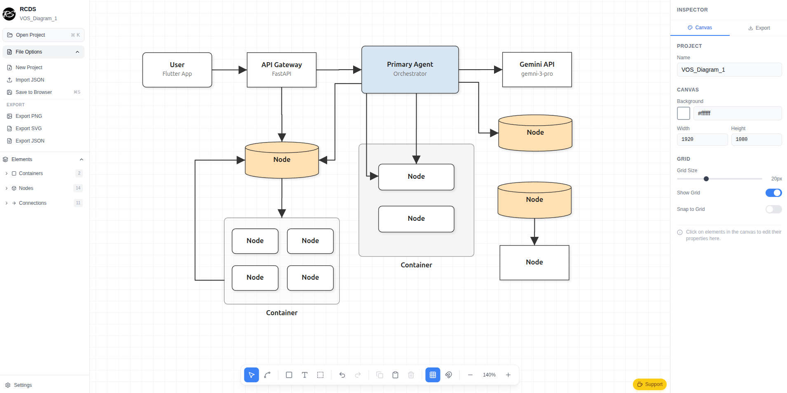

# RCDS - Open Source Diagram Editor

[](https://nextjs.org/)
[](https://react.dev/)
[](https://www.typescriptlang.org/)
[](https://tailwindcss.com/)
[](https://claude.ai/code)
[](LICENSE)

> **Free, open-source alternative to Draw.io (diagrams.net), Lucidchart, and Figma for technical diagrams** — Create beautiful architecture diagrams, flowcharts, system designs, and network diagrams with a modern, publication-ready aesthetic.

<p align="center">
  
</p>

## Why RCDS?

RCDS (Romans Cool Diagram Software) is a **free, browser-based diagram editor** designed for developers, researchers, and technical writers who need **professional, academic-style diagrams** without the complexity of Figma or the dated look of Draw.io.

### Perfect For

- **System Architecture Diagrams** — Design microservices, APIs, and cloud infrastructure
- **Academic Papers & Research** — Publication-ready diagrams with clean, professional styling
- **Technical Documentation** — Flowcharts, sequence diagrams, and process flows
- **Software Design** — UML-style diagrams, entity relationships, and data flows
- **Network Topology** — Visualize infrastructure and network architecture
- **Presentations** — Export high-quality PNG, SVG, or PDF for slides

## Features

- **JSON-First Design** — Diagrams stored as JSON, fully version-controllable with Git
- **Academic Modern Theme** — Muted pastels, clean typography, publication-ready output
- **Visual Drag-and-Drop Editor** — Intuitive interface like Figma, but built for diagrams
- **Smart Orthogonal Routing** — Automatic 90-degree edge routing for clean connections
- **Multiple Export Formats** — PNG, SVG, PDF with pixel-perfect fidelity
- **Node Templates** — Pre-built shapes for common diagram elements
- **Containers & Groups** — Organize nodes into logical groupings
- **Grid & Snap** — Precise alignment with toggleable grid overlay
- **Local Storage** — Projects saved in browser (IndexedDB), no account required
- **Self-Hostable** — Run on your own infrastructure with Docker
- **100% Free & Open Source** — MIT licensed, no premium tiers

## Quick Start

```bash
git clone https://github.com/yourusername/Romans_Cool_Diagram_Software.git
cd Romans_Cool_Diagram_Software/frontend
npm install
npm run dev
```

Open http://localhost:3000

## Docker

```bash
docker-compose up --build
```

## Comparison

| Feature | RCDS | Draw.io | Lucidchart | Figma |
|---------|------|---------|------------|-------|
| Free & Open Source | Yes | Yes | No | No |
| JSON Export | Yes | XML | No | No |
| Academic Styling | Yes | No | No | Manual |
| Self-Hostable | Yes | Yes | No | No |
| No Account Required | Yes | Yes | No | No |
| Git-Friendly | Yes | Partial | No | No |

## JSON Schema

Diagrams are stored as JSON for easy versioning, diffing, and programmatic generation:

```typescript
interface Diagram {
  id: string;
  name: string;
  version: "1.0";
  canvas: { width, height, gridSize, snapToGrid };
  theme: string | Theme;
  nodeTemplates: Record<string, NodeTemplate>;
  nodes: DiagramNode[];
  edges: DiagramEdge[];
  containers: DiagramContainer[];
  legend?: Legend;
  title?: TitleBlock;
}
```

See `frontend/src/lib/schema/types.ts` for complete type definitions.

## Design System

Based on the "Academic Modern" / "Publication-Ready Technical" aesthetic:

| Color     | Hex     | Usage                          |
|-----------|---------|--------------------------------|
| Primary   | #D8E5F3 | Core components, orchestrators |
| Secondary | #E6E0EC | Memory, AI components          |
| Accent    | #FFE0B2 | Message brokers, transit       |
| Neutral   | #F5F5F5 | External entities, users       |

## Tech Stack

- **Frontend**: Next.js 14 + React 18 + TypeScript
- **Styling**: Tailwind CSS
- **State**: Zustand
- **Storage**: Dexie.js (IndexedDB)
- **Export**: html-to-image + jsPDF

## Project Structure

```
frontend/
├── src/
│   ├── app/              # Next.js App Router
│   ├── components/
│   │   ├── canvas/       # SVG rendering (DiagramCanvas, NodeRenderer, etc.)
│   │   ├── editor/       # UI components (Sidebar, ProjectsPanel)
│   │   └── ui/           # Shared components (Button)
│   ├── lib/
│   │   ├── schema/       # TypeScript types
│   │   ├── rendering/    # Edge routing algorithms
│   │   ├── export/       # PNG/SVG/PDF export
│   │   └── store/        # IndexedDB persistence
│   └── themes/           # Theme definitions
├── Dockerfile
└── package.json
```

## Contributing

Contributions welcome! Please open an issue or submit a PR.

## Keywords

diagram editor, open source diagram tool, draw.io alternative, drawio alternative, diagrams.net alternative, drawio.com alternative, lucidchart alternative, figma alternative for diagrams, free diagram software, architecture diagram tool, flowchart maker, system design tool, technical diagram editor, academic diagram software, publication-ready diagrams, JSON diagram format, self-hosted diagram tool, network diagram maker, UML diagram tool, ERD diagram tool, microservices architecture diagram, cloud architecture diagram, svg diagram export, react diagram editor

## License

MIT
